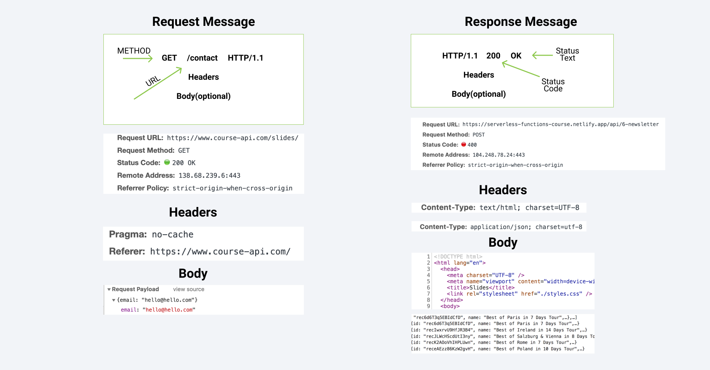
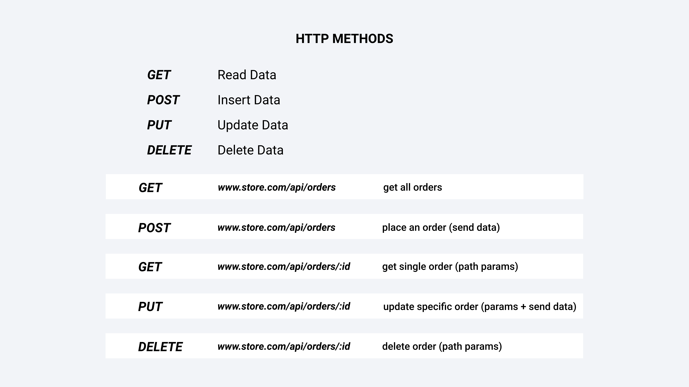
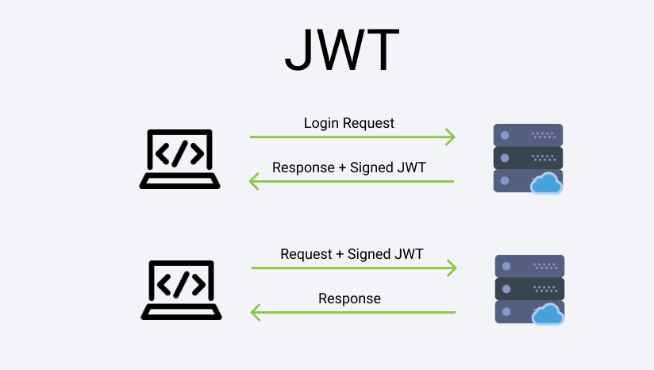

# Learn NodeJS

## What is NodeJS?

- Environment to run JavaScript outside the browser
- Built on Chrome's V8 JS Engine, which is the core of Google Chrome
- Node.js app runs in a single process without creating new thread for every request
- Node.js doesn't normally block, and is rather treated as an exception, which allows it to handle many requests without worrying about concurrency issues
- The most common example of Node.js is a server an example server
  - You normally need to include the `http` module
  - Then the `createServer()` method of `http` will create a new HTTP server and return it
  - We set the server to listen on a specified port and host name
  - When the server is ready, the callback function is called
  - Whenever a new request is recevied, the `request` event is called, providing two bojects
    - A request, which is an `http.IncomingMessage` object
    - A response, which is an `http.ServerResponse` object
- History
  - Node.js at this point (6/22/2022) is 13 years old.
  - Node.js in combination with the rising popularity of JavaScript and Google Chrome encouraged its growht
- Differences between Node.js and the Browser
  - Both use JavScript as their programming language, but there are many key differences
  - Node.js allows developers to program everything in just one language
  - Node.js also supports both ES modules and CommonJS, but the browser now only supports ES modules
- V8 JavaScript Engine
  - V8 is written in C++ and constantly improved
  - JavaScript used to be considered an interpreted language, but modern JavScript engines no longer just interpret it, they compile it
  - JavScript is internally compiled by V8 with just in time (JIT) compilation
- Node is mainly used to build server side apps

## Node Tutorial

### REPL vs CLI

- REPL vs CLI
  - REPL stands for read, evaluate, process loop, mostly used for playing around
  - CLI is used for running the app itself

### Globals, Import, and Export

- There are global variables in Node, but no window
- Every file in Node is a module
- Import and export
  - Require:
    - `module.exports = variable / object`
    - `require(path to file)` and you can destructure it
    - `module.exports.prop = variable / object`
- When you import a module, you will actually invoke it

### Built-In Modules

- There are many major modules in Node.js that are useful
  - The file module has either an asynchronous or synchronous version
    - The async version is better for most cases because the callbacks allows the program to run other things without having to wait for an expensive operation to finish executing

### HTTP Module

- Mostly used in server development
- The create server usually takes a request and the response
- Server will also listen for a specific port
- Web servers constantly listens for request
- Request is a giant object
  - The useful property inside of request is the url property, which we can use to setup the routes, etc.

### NPM

- One of the world's biggest code stores
- Good chance that someone has ran into the same issues as you and already resolved it
- Node Package Management
  - Allows us to use our own code in other projects
  - Use code written by other developers
  - Share our own solution with other developers
- Ex: React's `create-react-app` is a package on npm
- NPM calls reusable code a package
  - Package is a folder that contains JS code
  - Other names are modules and dependencies
  - Mostly used interchangeably
  - No quality control in the NPM registry: anyone can publish anything
  - A good indicator is the number of weekly downloads
  - When we install node, we also install npm, so we have access to npm global commands

### Event Loops in Node

- We will try to understand the general idea of it
- Event loop is what allows Node.js to perform non-blocking I/O operations - despite the fact that JavaScript is single-threaded - by offloading operations to the system kernel whenever possible.
- JavaScript is synchronous and single threaded
- It just runs everything line by line
- Browser provides the API to offload to it
  - ex: the `setTimeOut` function will the callback after executing the current code
- Example for event loop
- Consider an app, where there are users that requests something from the application
- The event loop makes sure it doesn't become a time consuing block of for loops
- Suppose someone requests a time consuming application
- The event loop registers the callback, the function gets put behind all the immediate code, and runs it after everything else is done running
- The problem, though, with async approach is that oftentimes the code gets messy really quickly
- However, you should always strive to work asynchronously to avoid large tasks holding up the resources
- One way to make the syntax easier to read is to write promises instead, or even better is to use await and async keywords
- Everytime you use the async await approach, you should wrap it in a try catch block
- Node has a native module `util` that enables you to easily write async await patterns, using a method called `promisify`

### Events

- Event-driven programming, where you listen for user actions
- Used heavily in Node.js
- Used a ton in the frontend, but equally used in the backend

### Event Emitter

- You need to the `events` module
- Two major attributes that we want to change
  - on: where we pass in the name of the event, and also a callback function, also known as subscribing to the event
  - emit: the same name as the on attribute
- The order of emit and on matters, you need to first listen for the event, and then emit it
- You don't listen for an event once it's been emitted
- Events are the core building blocks of Node

### Streams

- Used to read and write sequentially
- Writeable, Readable, Duplex (both read and write sequentially), transform
- It is useful when the file you're trying to write is enourmous, and you cannot place it inside of a variable
- It is not a good idea to send a large chunk through the internet, which will be what happens if you res.end(text)
- FileStream has a pipe method that pipes it into a writable stream

## Express Tutorial

### HTTP Request/Response Cycle

- 
- We perform a request to a server whenever we hit enter on the url address
- Those are sent using the HTTP protocal, which is why those are called HTTP messages
- The server then sends the HTTP response message
- We will use Node to build such a server, but to make our lives easier, we will use the Express Framework

### HTTP Messages

- 
- Methods talk to us about what exactly we want to do
- The image displays the get request
- The URL is just the web address
- The headers are optional and include meta information
  - They are usually key value pairs
- Optional body:
  - If you just want to read, then there is no body
  - If you want to write, then you will have to provide the body, which is also often called the payload
- Response message
  - Usually starts with the http version
  - Then it includes the status code and status text
  - 200 usually means success
  - 400 means an error
  - 404 means resource not found
  - The headers provides info about the response message
    - Content type: can be either HTML and JSON data

### HTTP Basics

- The server usually takes request and response, which are both releated to how HTML messages work
- Port is a communication endpoint. For all websites, there is an IP address, and behind it, it specifies the port address
  - You can think of port as an apartment number
  - Once the website is in production, the port numbers are not random
  - In local development, the convention for React is 5000
- When you type in the address and hit enter, you will see a spinning circle
  - It means that the user has hit the server
  - The method `response.end()`must be called on each response
  - That's what the spinning circle is for

### HTTP Headers

- So far, we haven't provided anything to the web browser
- To add more information for the response, we need to provide additional information to the headers
- The method is `response.writeHead(statusCode, {reasonPhrase:string (these are usually key value pairs)}`
- Most of the status codes can be found in Mozilla docs
  - 100 - information responses
  - 200 - successful responses
  - 300 - redirection responses
  - 400 - client error responses
- There are also MIME types, which are the string key value pairs that you provide
  - You describe to the browser what information you are actually sending back

### HTTP Request Object

- It is just a giant object in JavaScript
- There are many useful properties
  - `request.method`
    - Can be GET, POST, DELETE
  - `rquest.url`
    - Can indicate whether it's the home page or the relative path of the URL

### HTTP File

- We will pass in the content of the file, where we can essentially read the entire HTML file
- This way, we can serve the page with our server

### HTTP App Exxample

- Every time you have a path in the HTML, you will send a request to the server
- Telling it to provide it all the files
- To fix it, the brute force way will be to add more `if-else` statements
- The idea is that this is clearly a very bad approach for setting up the files, since if you have many of them it will be close to impossible
- This is where Express comes in

## Express Tutorial

- A very standard package
- Installation is just like another package in npm, but you also need the `--save` flag due to a bug in the previous versions
- Using express is actually very similar to using `http` and the create server
- Most common methods that are used are
  - `app.get`, `app.post`, `app.put`, `app.delete`, `app.listen`, `app.all`, `app.all`
  - These verbs correspond to the `http` verbs
- `app.all` will catch everything in a server
  - This is especially useful for catching URLs that are not listed
- Express will default to status code 200, but in general, it is good practice to chain the status and the send to distinguish between the different response messages
- Resolve in the `path` module helps to create
- If we were just using the `http` module, then we would need to go with other possible urls in order to load in the necessary resources for the app
- However, in express, you can use the `app.use(express.static('./public'))` method to get those static resources, and the convention is to call those resources in a folder named `public`, and we don't have to add any imports
  - `express.static()` is a built in middleware, which will be covered later in the videos
- Static assets mean that it is a file that doesn't have to be changed by the server
- By doing this, you don't need to create a url for everything single asset that you have
- Interestingly, the `index.html` is another static asset, and there are two ways that we can import them
  - Currently, we are using `sendFile` to send back the `index.html` file. However, in gerenal, it is not what it's used for
  - The other option is to add it to static assets, which should work in most general scenarios
  - The last option is server-side rendering, or SSR

### API vs. SSR

- When it comes to express, you will use one of two options
- API
  - In express, API means setting up an http interface to send data
  - Data is sent as a `JSON`, which stands for JavaScript Object Notation
  - To send back the data, we use the method `res.json()`, which stringifies and sends back the data
  - The main idea with API is to let it send data back to the user
- SSR
  - The other way is to send everything back ourselves, this is using the `res.render()` method

### JSON Basics

- `res.json()` sends a JSON response. This method sends a resposne that is the parameter converted to a JSON string using `JSON.stringify()`
- There are also query string parameters
- It is import to now that when you're fetching data, you don't always request everything in the data. For instance, for the shopping cart page, you might only want to send the minimum information.

### Route Parameters

- Route parameters are helpful for allowing you to pass in placeholders or variables into the URL address
- You add a prefix in front of the URL address with a colon
- And `req.params` includes all the parameters in the URL address
- If the array cannot find the product, it will return undefined and log nothing
  - One solution is to add an if else condition
- Make sure there's a forward slash in front of the path when using the `app.get()` function

### Query String Parameters / URL Parameters

- Send small amount of information through the URL
- Usually used to query the database and filter the results
  - Ex: `http://domainName.com/api/version/items/:id`
    - This is a very common practice
  - Ex: `http://domainName.com/api/version/search?query=foot&tags=story`
    - The information after the question mark are information specific to this query
- The key value pairs are setup on the server
- You separate the URL key value pairs with `&`
- Using send will actually cause an error
  - If we omit the return, then JavaScript will keep on reading the code, causing errors
  - `Cannot set headers after sent to the client`
  - This means you need to add a return

### Middleware

- Middleware are functions that execute during the request to the server
- Each middleware has access to request and response object
- Middleware is everywhere in Express
- `req => middleware => res`
- The whole idea with middleware is to reduce code duplication
  - Setup a function that can be attached to certain routes
- The great feature about the Express is that when you setup a middleware function, it will automatically pass into it, a `req`, `res`, and a `next` parameter, so we just have to specify it in the function header
- Now you will get a spinner
  - The reason why is because you must send it to a next maneuver, `next()`
  - Or you can terminate the whole cycle with a `req.send`

### `app.use`

- The problem is that it is clunking up our code and it's not very clean to use
- `app.use` is a function that can add it to all of the routes or any routes you want
  - The other important thing is that order matters when it comes to `app.use()`
  - So any routes before that declaration will not have the middleware attached
  - `app.use()` can also be used with a path, so you can specify which routes will get that middleware
  - The terminology is mounting the middleware, omitting the path will apply it to all routes

### Multiple Middleware Functions

- The syntax for multiple middlewares is `app.use([function1, function2, ...])`
- The order that you mount the middlewares also matters, the one mounted first will be executed first
- The example for logger and authorization is just an example, normally to authorize a user, you will be using a JSON web token
  - If the token exist, then we authorize the user and all routes have access to the properties that are attached by the middleware

### Use vs Route

- You can also add multiple middlewares into the specific route, such as `app.`
- Other options:
  - Our own
  - Express
  - Third party
    - One of the most popular packages for handling log in is `morgan`
- The larger the express the app, the more likely it is to have more middleware functions

### HTTP Methods

- Get- read data
  - Default method the browser runs
- POST - insert data
  - When you're sending a POST request, the method body is required
  - To use the post method to change your data, you need to use a middleware
  - In this case, we use the built-in `express.urlencoded()` middleware
  - Another way to send post is with Axios, which is implemented with a CDN
  - The difference between Axios/JavaScript and Form is the `content-type` of the data
  - Testing these APIs will take a while if you also need to create the frontend for it. Therefore, a tool that we can do is using Postman
- PUT - update data
  - To update, you usually need to pass in additional data, and the convention is to use a colon to denote the variable
  - PUT has two sides to this
    - `req.params`- the old data
    - `res.body` - the new data
    - Currently, we are not persisting that data
    - At the end of the day, when you are building an application, you are expecting someone else will be using that data
- DELETE - delete data
  - Very similar to put, except you no longer need the body like you do for put
- HTTP Methods
  - 

### Express Router

- The moment you have more routes, you immediately run into a problem, which is that `app.js` becomes quite busy
- The solution is using express router, where we can group the routes together
- The common setup for this is ModelViewController(MVC), which is useful for setting up APIs
- We note there are a lot of common routes in the current file, which all start with `/api/people/`
- The common convention is creating a new folder in the root called `routes`
- Inside the files, the path you need is actually just the part after whatever the main route is inside of `app`

### Express Router Controllers

- Unfortunately, it is still cramped inside `people.js`, we can fix this with controllers
- The common convention is to create a folder in the root directory called `controllers`
- There are two flavors to setting up the routes
  - The functionalites will be the same

## Task Manager API

- In this project, we will connect to an online database in order to store and access remote data, which will be MongoDB
- It's useful to have version in the API URL because then you can easily update the version number

### REST APIs

- We are using the structure with the colons because we are building a REST API
- Its goal is to setup an HTML interface
- It stands for Representational State Transfer
  - Combines HTML verbs and data
- It's a pattern, not a strict set of rules
  - There are many different other structures, but make sure you're consistent
- Our APIs allow the users to perform a KROD operation on our data
  - CRUD: Create, Read, Update, and Destroy, which is used often for user related data

### MongoDB

- NoSQL, non-relational Database
- Store JSON
- Easy to get started annd free cloud hosting service: Atlast
- Document is a set of key value pairs, which is what it stores
- Inside the database, we have collections, which are tables
  - In each collection, we have group of MongoDB documents
- Document represent one single entry, sort of like a record
- By default, we are given an `_id` attribute
- You also need to specify the type, you can also have documents with the same `_id`, but that's not something that you should be doing, and Mongoose will help to eliminate that possibility
- The MongoDB GUI essentially allows you to perform the CRUD operations

### Mongoose Info

- Alternative to Mongodb
- It is useful because a lot of function rights out of the box
- However, just using the connection string, our database and server are connected separately
  - What we want is to only spin up the server if the connection to the database is successful and forget about it otherwise
- To do this, we invoke it inside the `app`
  - Create a `connectDB` function inside `connect.js` and a `start` function inside `app.js`, and then invoke it
- Finally, we want to setup the environment variables
  - This is to avoid people from accessing the connection string, so make sure the `.gitignore` file has `.env` ignored
- You will be able to access those variables by `require('dotenv').config()`

### Schema and Model

- Now, we want to be able to create the schema and assign it to Mongo
- This is where you create the `models` folder and then define the schema inside it
- Initially on the cluster, we don't have a defined structure, but this is exactly where we define it
- Think of `model` as a representation of the collection
- The model is also a wrapper for the schema
- Mongoose gives us the interface to interact with the database
- Based on the Mongoose docs, an instance of a `model` is called a document
  - `mongoose.model()`: The first argument is the singular name of the collection the model is for, and Mongoose automatically looks for the plural, lowercased version of your model name.
- If you try to add properties that doesn't conform to the database schema, it will only filter thte properties that are set in the database

### Validation

- There is still not validation, and we can send in empty values
  - You can send in an empty object and it will still be succesful
- You can do that by specifying it in the database schema, which is supposedly handled by Mongoose
- Flags such as `default` and `required` can help to prevent those errors
- We've been able to validate our data; however, the user will be left hanging when there's no response or an error, so we need to handle that with a try-catch block
- Queries are not promises, but it appears we can use `async` and `await` keywords regardless
- When finding the single task, we note that that we get two different errors
  - `404` is the not found error
  - The actual syntax of the id might also be totally off (not enough characters), and in that case, we actually need to take care of that as well, and it will display as `CastError`
- In the frontend, we don't actually really worry about it, we just re-display the entire list again
- The update method is actually a little more complicated and we need to pass in some options in the back to make sure its working. In this case, we need to put `new: true` and `runValidators: true`
- Now there are just some improvements that we want to make

### PUT vs PATCH

- PUT and PATCH are both used for updating the resources. However, the assumptions are different
  - PUT assumes you're trying to replace the existing resource
  - PATCH is for partial update
    - Only the passed in properties will be updated
- The biggest difference is that if you only put in a partial number of properties, the whole object will only have the properties you passed in and nothing else
- By default, Mongoose will PATCH, the option is `overwrite: true`

### Response Types

- This is regarding the object that we're sending back, and you can send whatever you want back
  - Ex: `res.status(200).json({ task })`
- It might not be a good idea to include data as an attribute because `axios` will already handle that for you

### Not Found

- We can set up our own custom error response message
- To do this, we need to create it as a middleware, and then call `app.use(notFound)` to use that middleware

### Async Wrapper

- Using `async` and `await` can become extremely redundant. Thus, we will use a wrapper to remove redundancy
- The solution is using a middleware
- Important to remember that `async` functions will always return a promise
- It is also important to note that the `next` function will transfer you to the next middleware

### Custom Error Classes

- We can also handle errors by creating a new error class that extends from the JavaScript class

### Port Variables

- This is used to allow you to control and protect secret data
- This will be stored inside the `.env` file

### Easy Bugs That Can Cause A Lot of Issues

- The order in which you use the middleware matters. Using the error middleware before you use your routes will automatically cause it to go to the error.

## Store-API

- The idea is allowing the users to make different searches with filter options
- Coems from the HackerNews API
- This allows the backend to do all the heavy lifting and the frontend just have to make the HTTP calls

### Setting up the app

- Remember to invoke `require('dotenv').config()` to allow it to access variables in the environment file
- Last time, we wrote our own async wrapper in order to have that try catch block; however, there are also packages that can do that for us, which is where `express-async-errors` come into play
- Instead of calling next, just throw a new error and it will take care of it automatically
- Creating the model for the database requires the `mongoose` package
  - Use the `enum` property to limit the values that a property can be
  - We can also set up custom error messages if the values don't match

### Mongo Setup

- Now we need to populate our database, and we can simply do that by doing that with a script that takes in a `JSON` file
- For setting up search queries, you can go with the following setup:
  - `/api/v1/search?query=...`
  - These are the query string parameters
  - Question mark starts the query and ampersand separates the parameters
- In V6 of Mongoose, nonexisting properties will be ignored, which is actually a little more convenient
- Mongoose also proicdes various query operators
  - Ex: `$regex`

### Filtering Methods

- Sorting will take multiple parameters
  - `-` sign represents you want it in descending order
  - `,` to separate the order of values in which you want them sorted
  - You will just have to chain the different filters
- Select/fields displays only the selected options, and the method name is `select`
- Limit returns the number of products you get back
- Skip just skips the first few items in the list
- You combine `limit` and `skip` to setup pagination
  - I think usually you should skip first, and then limit the result
- Numeric conditions, filtering based on numeric values
  - Such as where price = 30
  - `NumericFilters=price>30`
  - Based on the Mongoose docs, we need to use query operators `$gt` and `$lt`
  - To be able to filter them, we need to use `regex` again

## JWT (JSON Web Token) Basics

- Think of them as long strings
- Imagine we have two routes, dashboard and login/register route.
  - Dashboard is protected, and you can only access it if you login
  - 401 is the unauthorized error
- Will be available as long as the valid token is in the request

### Validate Username and Password

- Username and password are both in `req.body`
- So, if we both exists, we will create a new JWT, and we send it back to front-end
- We need to then send it back to the frontend to have it send the request
- Setup authorization so only the requets with JWT can access the dashboard
- There are several approaches when it comes to validation
  - One way we can validate is using a database, where we can use Mongoose validation
  - Another way is to setup a layer of validation ourselves, the package is `JOI`
  - Checking the values in the function itself

### JWT Overview

- 
- JSON Web Token is just a way to exchange data between two parties
  - Such as Frontend App and APIs
  - Much better than a simple string, because JWT has a security feature
  - If the token passes the validation, it's the same token that we sent to the client
  - HTML is by default stateless, so it won't be able to remember any information sent by the client
- A very good resource is `JWT.IO`
  - Information can be signed and used as a secret
- The JWT consists of two parts
  - One is the type of token, which in our case is JWT
  - The other is the algorithm used to create that signature, which can be `RSA`, `SHA256`, `HMAC`
- Then we place the payload into the JSON, and we send the JSON to the server
  - We also need to add a `secret` attribute to sign off on the JWT
- Encoded JWT is just a string, and decoded will be a JSON will various information
- There are various packages for JWT
  - In this project, we will use `jsonwebtoken`
- These are useful methods in the package
  - `jwt.sign(payload)`, you don't want to include confidential information in the paylaod
  - `.env` file includes a secret string we're sending, you want it to be unguessable
  - `jwt.verify(token, secretStr)`

### Bearer Schema

- `Authorization: Bearer <token>`
- You store the token somewhere on the frontend, and then you send make the requests to the APIs
- To get to the values sent after validating the token, we will need to process it further with JavaScript

### Auth Middleware

- Now, we can improve our code by factoring functionalites out as middlewares

### Custom Errors

- Since we have two different types of errors, it is actually better to separate those two types of errors
- `http-status-codes` is a package that helps with errors

## Jobs API

- General setup is the same as before, with the controllers, routes, middleware, database, and models
- With websites that involve accounts, the important route and controller to worry about is the authentication route

### Hashing Passwords

- Now we are able to store user info onto the database, but what we're also storing in there are passwords, which is bad news if someone is able to break into the database
- So, never ever store passwords as strings, and we want to hash them
- The library we will use is `bcryptjs`
- How hashing works is you need the library to generate a salt, which is a set of random bytes, and then you hash the password based on that salt
  - You can also specify the number of rounds, which is by default 10, and is usually more than enough
  - And this hashed password is safe to store on the database
- In order to not bloat the controller, we can put this hashing logic somewhere else
- Lastly, we also need to send the JWT token
- For response, we always want to send back the token so it knows the user is valid
- Mongoose also provides other methods to send back the token, this is an `Instance` method

### JWT Strings

- JSON Web Tokens have important strings such as `JWT_SECRET` and `JWT_LIFETIME`
- Something you can do is use a key generator: `All keys generator`
  - This is an encryption key with 256 bits
- `JWT_LIFETIME` represents how many days the token will be alive for, this is the `expiresIn` attribute

### Login Functionality

- We can now try to login the user given their passwords, etc.
- We will try to find the user in the database, and if we can't find it, we will return an error
- To make sure that the password is correct, we need the compare function from `bcryptjs`
- We will also need to validate the header of the authentication, and we can do that with the `auth` middleware
  - This is where we actually verify the `jwt` token

### Job Model

- Similar to the user model, but in addition to it, we need to tie the user to the object, and we can do that with `mongoose.Types.ObjectID`
- In order test the functionalities of authorization in PostMan, we needed to copy and paste the tokens constantly; however, we can set tokens dynamically in PostMan, and that is by navigating to tests under the request and setting a global variable

### Providing More User Friendly Errors

- Mongoose currently only have three different errors, but the internal server error is sent back and doesn't specify what the error is
- We can write a custom error object within the handler so we don't need the `custom-api` error class anymore
- Essentially, this process goes into the error-handler and catches all the different types of errors are that possible to occur.

### Security Info and Packages

- We will be deploying this app onto the cloud, so we need to worry about security; however, many npm packages already are able to take care of that for us
- `helmet` is a package that includes many different headers for security reasons
- `cors` allows you to access APIs from different domains
  - Cross Origin Resource Sharing- mechanism to allow you to request for resources
- `xxs-clean` sanitizes the user input, prevent injection attacks
- `express-rate-limit` limits the amount of requests the user can send

### Heroku

- Heroku also utilizes git control, so we will need git along with it
- Now we will deploy application onto the server
  - Generally just follow the instructions for the Heroku CLI, which includes adding an engine to the `package.json` file, and also changing the start script to `node` instead of `nodemon`
- We also need a `Procfile`
- After which we need to initialize an empty `git` file and then login to heroku and use the command `heroku create appName`
- Then you can set some environment variables with `heroku set:NAME=value`
  - Another way, which is probably the more straight forward way, is to use the GUI on heroku
- Then you can push the git repo to heroku with `git push heroku master`
- That was pretty much the deployment to Heroku, and now we will use swagger UI to develop a quick frontend for our project

### Uploading Docs with Swagger

- Postman allows you upload your own documentation as well; however, we want it to be uploaded on our own server, so we will use swagger to achieve that
- Go to the collection and click on export in Postman
- However, we can directly pass in Postman docs into Swagger UI and we need to format it first
